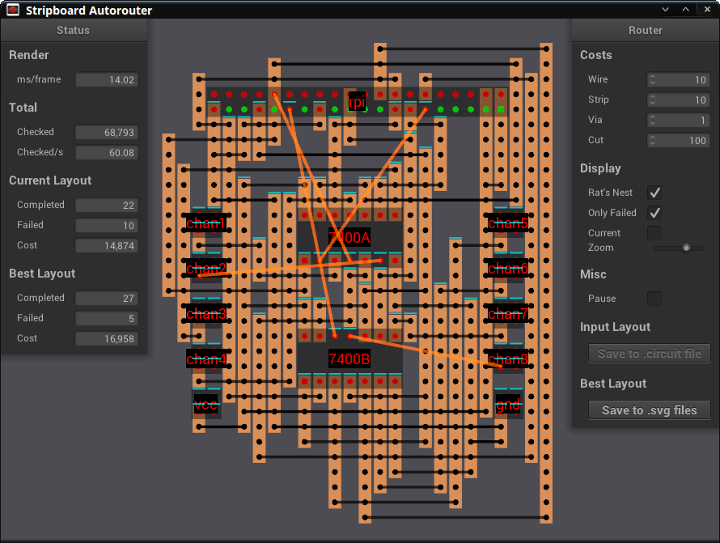

## Stripboard Autorouter



**Note**: Beta software, but should be ready for testing in real projects. Tested on Windows 10 64-bit and Linux Mint 18 64-bit. See [Releases](https://github.com/rogerdahl/striprouter/releases) for Windows and Linux binaries.

This is a cross-platform program that, given a description of a circuit, searches for the best way to create the required connections on a [stripboard](https://en.wikipedia.org/wiki/Stripboard).

The output is a description of where to place and solder wires and where to cut the copper traces on the stripboard in order to create the connections.

Costs can be assigned to resources such as stripboard area and solder points in order to direct the router towards preferred layouts.

The program searches only for routes that use non-overlapping wires that cross the traces at right angles, which tends to give clean layouts, and which allows using only uninsulated wires.   

If a good layout is found, the solution can be printed in two separate layers, with the bottom layer showing the required copper trace cuts, and the top layer showing the required wires. The printed sheets are then fastened to the board with paper glue or tape one layer at a time, providing an exact reference while working on the board. Wires can be placed by poking them through the indicated locations on the paper, and traces are cut through the paper.

Currently implemented:

* Parse circuit description file 
* Automatic routing, aware of nets and indirect connections 
* Visualize circuit and discovered routes
* GUI controls
* Move components with mouse
* Zoom and pan with mouse wheel and drag
* Highlight connections and nets with mouse hover
* Find and display the minimally required copper trace cut positions
* Write component position changes back to the circuit file
* Write the best solution to .svg (Scalable Vector Grahics) files for 1:1 printing

Planned functionality:
 
* Better search algorithm
* Support components such as resistors and diodes that have variable length connectors
* Automatic optimization of component locations


### How to use

* Start the program. You should see it start searching for routes on the included circuit. There will be several updates over the first few seconds, and then update frequency will slow down as it becomes harder for the program to find a layout that is better than the current best.
 
* Move the program to one side of the screen and open the included `circuits/example.circuit` file in a text editor on the other. Start creating your circuit there, using the simple syntax shown in the file. Alternately, the path to another `.circuit` file can be given as a command line argument when starting the program.
 
    * `Board` The size of the stripboard, specified by number of vias (through holes) horizontally and vertically, as seen when the copper strips run vertically. The board must be large enough that the circuit and routes will fit but should not be larger than necessary, as search speed slows down when board size increases.

    * `Package` Reusable pin layouts. Each pin is designated by a coordinate relative to pin 1, so pins can be in any order and relationship to each other.

    * `Component` Name, position and package for a component. The position specifies the location of pin 1 on the board.
 
    * `Connection` Connections between component pins required for the circuit.
    
    * `Don't Care` Specify component pins that are not internally connected,have been removed, or which control features that are not in use. Setting pins as "Don't Care" allows the router to use strip segments that are connected to the pins, for unrelated routes. This often allows the router to go under a component instead of around it.

    * `Offset` This is a shortcut that is not typically needed. Allows setting an offset that will be added to the positions of all components that are declared below in the file. This makes it easier to adjust the positions of a group of components while maintaining their relative positions. Can be used multiple times. The offset that was last set remains in effect until disabled with `offset 0,0`.

* Packages, components and connections can be intermixed, however packages must be declared before the components in which they are used, and so on. The dependencies are as follows:

        Board > Package > Offset > Component > Connection > Don't Care

* If you are familiar with the netlists supported by most PCB design software, you will have noticed that the `.circuit` file does not support specifying nets. Instead, the nets are inferred from the point-to-point connections at runtime. In the `.circuit` file, simply reuse pins as often as necessary, as shown for the `vcc` and `gnd` connections in the included example.   

* Whenever you want to see the current status of your `.circuit` file, just save it in the editor to display the new version in the router. If there are any problems in the file, a list of errors is shown in the router.

* Components can be moved with the mouse. Clicking `Save to .circuit file` updates the `.circuit` file with the new positions. To avoid losing unsaved changes, save the `.circuit` file in the editor before saving in the router.

* Wait while the program searches for better layouts. Currently, only a simple random search is implemented. As long as `Pause` is not checked, the program keeps searching for a better layout.

* If no satisfactory layouts are found, click `Rat's Nest` to view the required connections and try moving the components to create more space between them, reduce crossed connections and reduce interference in problem areas with many failed routes. A complete layout can usually be found if there is enough room for routes between the components.

* Click `Current` to see the current layouts as they are being tested. Most layouts are dropped after routing due to having lower scores than the best layout found so far. 

* If you find a layout that you wish to use, click `Save to .svg files`. This will save two files in Scalable Vector Graphics format. The files are stored in the same folder as the currently open `.circuit` file, with filenames that match the `.circuit` file. The file named `.wires.svg` shows the required wire connections and the file named `.cuts.svg` shows the required copper strip cuts. The names include number of completed and failed routes for the solution, and the score for the completed routes.   

* The `.svg` files contain exact physical size information so, when printed, should match the size of the stripboard. The `.cuts.svg` shows the cut locations as seen from the copper stripe side. It's a mirror image as compared to `wires.svg`. That way, the two sheets can be fastened to each side of the board with paper glue or tape. Then the wires and cuts can be done through the paper, reducing the chance of errors.      

* To print the `.svg` files, open them in a graphics editor, such as the excellent [Inkscape](https://inkscape.org/en/), which is free, open source, and available for Linux, Mac and Windows. Make sure that the scale is set to 100% in the printer dialog, since the print will not match the board if the scale is wrong. If the print does not match even when the scale is set to 100%, you may be the unfortunate owner of a printer that does not print to scale. Laser printers are somewhat less reliable than inkjet printers in this regard.


### Tips and Tricks

* The costs can be adjusted by hovering over the numbers and spinning the mouse wheel.

* If the router is unable to find routes for all the required connections, the unrouted connections are shown in the layout. These can then be added by creating regular point-to-point connections with insulated wire at solder time.
  
* Some designs, such as [Rasperry Pi "Hats"](https://shop.pimoroni.com/collections/hats) require a double row header on the edge of the board. In the case of the Raspberry Pi, this is a 2x20 pin header. In order to connect to the outer header pins, the router must go around the header and use board area on the outer side for wires and traces, which makes it impossible for the header to be at the edge of the board. The more connections are required for the outer row, the further in on the board the header must be located.

  Depending on the physical requirements for the final board, this may be acceptable. If it's not, you may be able to keep the double header at the edge of the board with one of these options:
  
    * Leave the connections to the outer row of the header out of the circuit description, so that the router does not know about them. Then, create direct point-to-point connections for them at solder time.
  
    * Keep the outer row connections in the circuit description and use the resulting routes as hints on how to best create your connections.
  
    * Represent the double header with two single headers in the circuit description. Put one single header at the actual location of the inner row of the double header and put the other in another location on the board. The opposite side may be best. The router can then route directly to each of the single row headers without using area outside the headers. At solder time, connect the outer row of the double header to the row of points that were used by the router. Using an insulated flat cable can be convenient. Old IDE and floppy cables work well for this.

    * Determine which pins you will be using on the header and remove the unused pins before soldering the header to the board (making sure to keep enough pins that the header can be fastened properly). Then, configure the removed pins as `Don't Care` in the `.circuit` file. The router will then be able to reach the pins in the outer row by going past the `Don't Care` pins.    

* Bonus: If you zoom in far enough, you get free modern art, such as [this](./art.png) :)


### Implementation

* The program operates with objects called Layouts. Each Layout contains a Circuit object, a Settings object, potentially a set of discovered routes for the circuit, and misc other housekeeping and diagnostics information.

* A Circuit holds a description of the components and connections that make up a circuit, much like the information in the `.circuit` file. 

* Settings holds various settings that are used when processing the Layout, such as the resource costs that are used by the router.
 
* When the program starts, it creates three Layouts called inputLayout, currentLayout and bestLayout. The main thread then launches a set of router threads, typically one per logical core in the CPU(s), and a single parser thread.

* The parser thread gains exclusive access to the `.circuit` file, parses it to a thread local Circuit and releases the file. It then locks the inputLayout and writes the local Circuit to the inputLayout Circuit. Then monitors the modified time on the `.circuit` file and, if it changes, starts over with gaining exclusive access to the file.

* The router threads compete for a lock on inputLayout. When a thread gets the lock, it creates a thread local copy of inputLayout, called threadLayout and releases the lock. Because the router always uses the lowest cost route for a given connection, only the order in which the routes are created affects the end result. So, as a temporary first approach, a random search is currently implemented by having the thread start by randomly shuffling the order of the connections in its threadLayout. It then creates, or attempts to create, the routes in the shuffled order. The number of ways the connections can be shuffled is the factorial of the number of connections, which makes it impossible to check all possible orderings even for small circuits.

    The router is based on a custom implementation of the Uniform Cost Search algorithm and includes a common optimization based on using a set and a priority queue. The search is restricted to only find paths that can be implemented on a stripboard, the most important limitation being that there are two layers, where one layer can have only horizontal connections and the other can have only vertical connections.

    The Uniform Cost Search is based on assigning a cost to each point that can possibly be reached, so the cost for a completed route is the total of the costs of the points along the route. When the routing is completed, the costs for each of the routes are summed up to get the total cost for the Layout. 
   
    After completing the Layout, the thread locks bestLayout and compares the threadLayout and bestLayout for cost and number of completed routes. If threadLayout has more completed routes, or the same number of routes but a lower cost, it is considered to be better, and the thread copies it to bestLayout, overwriting the old bestLayout. The thread then always locks currentLayout and writes threadLayout to it, and loops back to the start, where it again locks inputLayout.
    
* Each Layout has a timestamp that is used for keeping track of lineage between Layouts. This is done so that, when the inputLayout changes, work on downstream Layouts for which the results are no longer needed, can be aborted. Outdated threadLayout, currentLayout and bestLayout objects are then dropped, which causes them to be replaced with layouts based on the new inputLayout.
   
* The main thread runs the GUI and OpenGL rendering. When a setting is changed or components are moved through the GUI, the main thread locks inputLayout and updates its Settings or Circuit. The main thread renders the inputLayout while a drag/drop operation is performed and bestLayout if the `Show best` checkbox is enabled. Otherwise, it renders currentLayout if its lineage is to the current inputLayout, else falls back to render the inputLayout. The end result being that the most current information is displayed.

    To avoid locking the Layout being rendered during the entire rendering process, the main thread briefly locks the Layout it will render and creates a thread local copy, then renders the copy and discards it.
   
* The router infers connected nets from the point-to-point connections described in `.circuit` and searches nets for potential shortcuts when routing. As routes are created, all points along the route are assigned to nets, using a structure that allows very fast checking for net membership when the points are encountered by the later Uniform Cost Searches.

* For routes that belong to nets, routes that reuse existing sections of earlier routes (instead of creating new sections), are preferred by setting very low costs for the reused sections.

### Technologies

* C++14, fmt, FreeType2, GLEW, GLFW 3, glm, GLU, libpng, NanoGUI, OpenGL, png++, simple_svg

### Example circuit description

This is the circuit description used in the screenshot.

```
# Raspberry Pi WS2812B NeoPixel LED level shifter and 8-channel multiplexer
#
# NOTE! This circuit has not been tested yet.
#
# RPi pins
#
# 5V   02
# GND  06
#
# PWM0 32
# GEN0 11
# GEN1 12
# GEN2 13
# GEN3 15
#
# PWM1 33
# GEN4 16
# GEN5 18
# GEN6 22
# GP05 29

# Board params (currently just size)
# board <number of horizontal vias> , <number of vertical vias>

board 60,60

# Packages
# <package name> <pin coordinates relative to pin 0>

dip14       0,0 1,0 2,0 3,0 4,0 5,0 6,0 6,-3 5,-3 4,-3 3,-3 2,-3 1,-3 0,-3
header2x20  0,0 0,-1 1,0 1,-1 2,0 2,-1 3,0 3,-1 4,0 4,-1 5,0 5,-1 6,0 6,-1 7,0 7,-1 8,0 8,-1 9,0 9,-1 10,0 10,-1 11,0 11,-1 12,0 12,-1 13,0 13,-1 14,0 14,-1 15,0 15,-1 16,0 16,-1 17,0 17,-1 18,0 18,-1 19,0 19,-1
hpad2x2     0,0 1,0 0,-1 1,-1

# Component position offset. Can be used multiple times to adjust section of
# circuit. Adds the given offset to the positions of components defined below.
# To disable, set to 0,0.
# offset <relative x pos>, <relative y pos>

# Components
# <component name> <package name> <absolute position of component pin 0>

rpi     header2x20  19,18

vcc     hpad2x2     17,37
gnd     hpad2x2     37,37

7400A   dip14       25,27
chan1   hpad2x2     17,25
chan2   hpad2x2     17,28
chan3   hpad2x2     17,31
chan4   hpad2x2     17,34

7400B   dip14       25,35
chan5   hpad2x2     37,25
chan6   hpad2x2     37,28
chan7   hpad2x2     37,31
chan8   hpad2x2     37,34

# "Don't Care" pins
# <component name> <comma separated list of pin indexes>
rpi 1, 3, 5, 7, 9, 17, 19, 21, 23, 27, 31, 35, 37

# Connections
# <from component name>.<pin index> <to component name>.<pin index>

# 7400A

vcc.1     rpi.2
vcc.1     7400A.14
gnd.1     rpi.6
gnd.1     7400A.7

rpi.32    7400A.1
rpi.32    7400A.4
rpi.32    7400A.10
rpi.32    7400A.13

rpi.11    7400A.2
rpi.12    7400A.5
rpi.13    7400A.9
rpi.15    7400A.12

7400A.3   chan1.1
7400A.6   chan2.1
7400A.8   chan3.1
7400A.11  chan4.1

# 7400B

vcc.1     rpi.4
vcc.1     7400B.14
gnd.1     rpi.14
gnd.1     7400B.7

rpi.33    7400B.1
rpi.33    7400B.4
rpi.33    7400B.10
rpi.33    7400B.13

rpi.16    7400B.2
rpi.18    7400B.5
rpi.22    7400B.9
rpi.29    7400B.12

7400B.3   chan5.1
7400B.6   chan6.1
7400B.8   chan7.1
7400B.11  chan8.1
```

### Compiling on Linux

* Tested on Linux Mint 18 64-bit.

#### Packaged dependencies

* $ `sudo apt-get install --yes cmake git build-essential libglm-dev libxrandr-dev libxinerama-dev libxcursor-dev libxi-dev libglew-dev libfreetype6-dev libglfw3-dev libz3-dev libpng++-dev` 

#### Striprouter source

* $ `git clone <copy and paste the "Clone with HTTPS " URL from the top of this page>`

#### fmt

* $ `cd striprouter/libraries/build`
* $ `wget https://github.com/fmtlib/fmt/archive/3.0.0.tar.gz`
* $ `tar xf 3.0.0.tar.gz `
* $ `cd fmt-3.0.0`
* $ `cmake -G 'Unix Makefiles'`
* $ `make`
* $ `cd ..`
* $ `cp -r --parents fmt-3.0.0/fmt ../linux`

#### Build

* $` cd striprouter/build`
* $ `cmake -G 'Unix Makefiles' ..`
* $ `make` 

#### Run

* $` cd striprouter/bin`
* $ `./striprouter`


### Compiling on Windows

* Tested on Windows 10 64-bit.

Include and library files need to be moved into the locations set up in CMakeLists.txt.

#### Visual Studio Community 2015

https://go.microsoft.com/fwlink/?LinkId=691978&clcid=0x409
* Chose the type of installation: Custom
* Unselect everything
* Select: Programming Languages > Visual C++ > Common Tools for Visual C++ 2015

#### CMake

https://cmake.org/download/ > `cmake-3.6.3-win64-x64.msi`

#### FreeType2

https://sourceforge.net/projects/freetype/ > ft263.zip (2.6.3)
* Open the CMake GUI and browse to the source.
* Use default native compilers
* Source: ft263/freetype-2.6.3
* Build: ft263/freetype-2.6.3/builds
* If "already exists" error: File > Delete Cache
* Click Configure
* Specify the generator for this project > Visual Studio 14 2015 Win64
* Ignore error: "Could NOT find PkgConfig (missing:  PKG_CONFIG_EXECUTABLE)"
* Click Generate
* Open freetype-2.6.3\builds\freetype.sln
* Layout Configurations > Release
* Build > Build Layout

#### GLFW

http://www.glfw.org/download.html > 64-bit Windows binaries

#### fmt

https://github.com/cppformat/cppformat/releases > 3.0.1
* Open the CMake GUI and browse to the source.
* Use default native compilers
* Source: fmt-3.0.1
* Build: fmt-3.0.1/builds (create the builds dir)
* Click Configure
* Select only: FMT_INSTALL, FMT_USE_CPP11
* Click Generate
* Open libraries\win64\fmt-3.0.1\builds\FMT.sln
* Probably no longer required: Right click Layout "FMT" > Retarget solution
* Layout Configurations > Release
* Build > Build Layout

#### glm

https://github.com/g-truc/glm/releases > 0.9.7.4

glm is header only. Just move into place.

#### GLEW

https://sourceforge.net/projects/glew/ > 1.13.0

Copy `bin\Release\x64\glew32.dll` to `striprouter\bin`.

`glew32.dll` is the 64-bit DLL despite the conflicting name.

`lib\Release\x64\glew32.lib` is the corresponding 64-bit lib.

#### NanoGUI

git clone --recursive https://github.com/wjakob/nanogui.git

* Open in cmake > Configure
* Select only: NANOGUI_USE_GLAD, USE_MSVC_RUNTIME_LIBRARY_DLL
* Generate
* Open NanoGUI.sln
* Layout Configurations (toolbar) > Release
* Build > Build Layout
